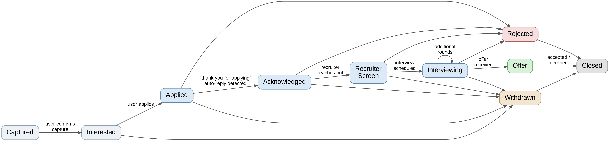

# Praedora — Consolidated Technical Design

*A self-hosted job application tracker with Gmail-driven status intelligence*
*Design synthesis, reconciling three prior drafts — August 2026*

---

# 1. Purpose of This Document

Three independent design drafts were produced for the same product concept. This document
reconciles them into a single authoritative design for **Praedora**, resolving every point
where the drafts disagreed and recording the decisions made along the way, together with the
reasoning behind them. Where a prior draft's approach was kept, it is credited; where it was
changed, the reason is stated so the decision doesn't need to be re-litigated later.

**Product thesis (unchanged across all drafts):** a job tracker you do not have to maintain by
hand. Save a job once; let email activity keep the timeline current; spend your attention on the
job search, not on data entry.

# 2. Scope Decisions

The following decisions were made explicitly during review and take precedence over anything
in the three source drafts.

| # | Topic | Decision |
|---|---|---|
| 1 | Persistence | SQLite by default (local, zero-install); Postgres or MS SQL as a config-only swap via EF Core, for Azure hosting later |
| 2 | Email provider | Gmail only, for now. On-demand sync and timer-based polling both call the same abstraction |
| 3 | Data model shape | Single `Application` entity carries both the job description and the pipeline state — no separate "saved/favorites" tier |
| 4 | State transitions | AI never writes application state directly. Every detected change is a candidate; the UI confirm action is the only thing that commits a state change |
| 5 | Duplicate detection | An active application already existing for the same company is flagged, not blocked |
| 6 | Authentication | None. Praedora is a local-only tool that trusts the network boundary it runs behind |
| 7 | Calendar integration | Out of scope. The core problem is "who have I applied to and what's the state," not interview scheduling |
| 8 | Error handling | Structured, queryable log entries plus an in-app log/diagnostics view; log entries are formatted to be pasted directly into a debugging conversation |
| 9 | Chrome extension | Required for MVP, not deferred. It creates a draft `Application` record directly |
| 10 | Deployment target | Local machine by default; Azure App Service as the fallback, using existing Azure account/resources |

Everything else in this document is the architecture built around these ten decisions.

# 3. High-Level Architecture

```
 Chrome Extension                  Blazor Server UI
 (capture JD + URL)                (Kanban, Detail, Review Queue, Log Viewer)
        |                                    |
        v                                    v
 +----------------------------------------------------------+
 |                  ASP.NET Core Host (Praedora.Api)         |
 |   Minimal API endpoints  |  Background sync worker        |
 +----------------------------------------------------------+
        |                |                |               |
        v                v                v               v
 IApplicationRepo   IEmailProvider   ILlmClassifier   INotifier
        |                |                |               |
        v                v                v               v
    EF Core          Gmail API        Claude API      Log / Toast /
  (SQLite/PG/MSSQL)   (OAuth)       (structured JSON)   SignalR push
```

Every external dependency — the database, Gmail, the LLM, notifications — is reached only
through an interface owned by `Praedora.Core`. Nothing in the domain or application layer
references EF Core, `Google.Apis.Gmail`, or an LLM SDK by name. This was an explicit
requirement (decision #2) and is applied uniformly, not just to email.

## 3.1 Request/Event Flow

**Manual path (primary, always available):**
1. User captures a job via the Chrome extension, or enters one manually in the UI.
2. A draft `Application` is created in the `Captured` state.
3. User reviews the extracted fields, confirms, and the application enters the active pipeline.
4. User progresses status via the Kanban board or detail view — this is a direct, immediate
   write, no AI involved.

**Email-assisted path (proposes, never commits):**
1. Gmail sync (on-demand or timed) fetches new messages via `IEmailProvider`.
2. A cheap deterministic filter discards obviously irrelevant mail (see §6.1).
3. Surviving messages go to `ILlmClassifier`, which returns a structured candidate: is this
   job-related, which application it likely belongs to, what status it implies, and a
   confidence score.
4. The candidate is written to a review queue. **It never touches `Application.Status`.**
5. The user opens the review queue, and confirms, edits, or dismisses each candidate.
6. Confirming a candidate calls the same state-transition path as a manual status change —
   from the system's point of view, AI-confirmed and manually-entered transitions are
   identical once they reach the domain layer.

# 4. Solution Structure

```
Praedora.sln
├── src/
│   ├── Praedora.Core/                 # Domain models, enums, ALL interfaces. No external deps.
│   │   ├── Entities/
│   │   │   ├── Application.cs
│   │   │   ├── StatusEvent.cs
│   │   │   ├── Contact.cs
│   │   │   ├── EmailMessage.cs
│   │   │   ├── CandidateEvent.cs
│   │   │   └── LogEntry.cs
│   │   ├── Enums/
│   │   │   ├── ApplicationStatus.cs
│   │   │   ├── EventSource.cs
│   │   │   └── CandidateStatus.cs
│   │   └── Interfaces/
│   │       ├── IApplicationRepository.cs
│   │       ├── IEmailProvider.cs
│   │       ├── ILlmClassifier.cs
│   │       ├── IJobDescriptionExtractor.cs
│   │       ├── IApplicationMatcher.cs
│   │       ├── INotifier.cs
│   │       └── ILogSink.cs
│   │
│   ├── Praedora.Application/          # Use-case services; orchestrates Core interfaces
│   │   ├── Services/
│   │   │   ├── ApplicationService.cs       # create, progress state, list board
│   │   │   ├── CaptureService.cs           # extension + manual capture -> draft Application
│   │   │   ├── EmailSyncService.cs         # drives IEmailProvider, dedupes, enqueues
│   │   │   ├── ClassificationService.cs    # calls ILlmClassifier, produces CandidateEvent
│   │   │   ├── MatchingService.cs          # resolves candidate -> Application, flags duplicates
│   │   │   └── ReviewQueueService.cs       # confirm / edit / dismiss candidates
│   │   └── DTOs/
│   │
│   ├── Praedora.Infrastructure/       # All concrete adapters. Swappable, isolated.
│   │   ├── Data/
│   │   │   ├── PraedoraDbContext.cs
│   │   │   ├── Migrations.Sqlite/
│   │   │   ├── Migrations.Postgres/
│   │   │   └── Repositories/
│   │   ├── Email/
│   │   │   └── GmailEmailProvider.cs       # implements IEmailProvider via Gmail API/OAuth
│   │   ├── Llm/
│   │   │   ├── ClaudeClassifier.cs         # implements ILlmClassifier
│   │   │   └── ClaudeJobDescriptionExtractor.cs
│   │   ├── Notifications/
│   │   │   ├── SignalRNotifier.cs
│   │   │   └── DesktopToastNotifier.cs     # optional, phase 2
│   │   └── Logging/
│   │       └── DatabaseLogSink.cs          # implements ILogSink, backs the log viewer
│   │
│   ├── Praedora.Api/                  # ASP.NET Core host: Minimal API + background worker
│   │   ├── Endpoints/
│   │   │   ├── ApplicationEndpoints.cs
│   │   │   ├── CaptureEndpoints.cs         # POST /api/capture (Chrome extension target)
│   │   │   ├── ReviewQueueEndpoints.cs
│   │   │   └── LogEndpoints.cs
│   │   ├── Workers/
│   │   │   └── EmailSyncWorker.cs          # BackgroundService; timer-based, plus on-demand trigger
│   │   ├── Program.cs
│   │   └── appsettings.json                # provider selection: Sqlite | Postgres | SqlServer
│   │
│   ├── Praedora.Web/                  # Blazor Server UI
│   │   ├── Components/
│   │   │   ├── KanbanBoard.razor
│   │   │   ├── ApplicationCard.razor
│   │   │   ├── ApplicationDetail.razor
│   │   │   ├── ReviewQueuePanel.razor      # confirm / edit / dismiss candidates
│   │   │   ├── DuplicateWarningBanner.razor
│   │   │   └── LogViewer.razor             # "log window" — filterable, copyable entries
│   │   ├── Hubs/
│   │   │   └── PraedoraHub.cs               # SignalR: push board + queue updates
│   │   └── Program.cs
│   │
│   └── Praedora.Extension/            # Chrome Extension (Manifest V3)
│       ├── manifest.json
│       ├── content.js                  # DOM parse: title, company, URL, salary, JD text
│       └── popup.html / popup.js       # review-before-send, then POST /api/capture
│
└── tests/
    ├── Praedora.Core.Tests/
    ├── Praedora.Application.Tests/
    └── Praedora.IntegrationTests/
```

`Praedora.Core` has zero external package references — this is deliberately preserved from
the strongest part of the original drafts. Every adapter (database, Gmail, LLM, notifications)
lives in `Praedora.Infrastructure` and is reached only through a `Core` interface, satisfying
decision #2 for every service, not only email.

# 5. Configuration Strategy

Configuration is split by lifecycle, not by convenience:

- **Startup/bootstrap configuration** — anything the app needs before it can reach its own
  database (connection strings, provider selection, Gmail OAuth client credentials, LLM API
  key, listening port) lives in a `.env` file, loaded via `DotNetEnv` at host startup in
  `Program.cs`. This is standard `.env` — not committed to source control, one file per
  environment (local, Azure).
- **Everything else is runtime/database-backed configuration** — settings the app can
  meaningfully change or that a user might reasonably want to adjust without a restart (sync
  interval, classification confidence display thresholds, notification preferences, feature
  toggles) is stored in a small `AppSetting` key/value table read through the same repository
  pattern as everything else, rather than added to `appsettings.json` or `.env` piecemeal.

This keeps the `.env` file small and stable (it only ever holds what's needed to *reach* the
database and external providers), while anything the app itself owns and might change lives
next to the rest of its data — which also means it's included in a normal SQLite/Postgres
backup without a separate mechanism.

```
# .env (example — not committed)
PRAEDORA_DB_PROVIDER=Sqlite
PRAEDORA_DB_CONNECTION=Data Source=praedora.db
GMAIL_OAUTH_CLIENT_ID=...
GMAIL_OAUTH_CLIENT_SECRET=...
CLAUDE_API_KEY=...
PRAEDORA_LISTEN_PORT=5080
```

```csharp
public class AppSetting
{
    public string Key { get; set; } = "";
    public string Value { get; set; } = "";
    public DateTimeOffset UpdatedAt { get; set; }
}
// e.g. Key="EmailSyncIntervalMinutes", Value="10"
// e.g. Key="ReviewQueueConfidenceSortDescending", Value="true"
```

# 6. Core Data Model

## 6.1 `Application` — the single aggregate

Per decision #3, there is no separate `JobPosting`/favorites entity. Capture and application
are the same record from the start.

```csharp
public enum ApplicationStatus
{
    Captured,        // extension/manual capture, not yet confirmed by user
    Interested,       // confirmed, not yet applied
    Applied,
    Acknowledged,     // receipt confirmed, e.g. "thank you for applying" auto-reply
    RecruiterScreen,
    Interviewing,
    Offer,
    Rejected,
    Withdrawn,
    Closed
}

public class Application
{
    public Guid Id { get; set; }
    public string CompanyName { get; set; } = "";
    public string RoleTitle { get; set; } = "";
    public string? SourceUrl { get; set; }

    // Job description — captured once, retained permanently
    public string JobDescriptionRaw { get; set; } = "";
    public string? JobDescriptionHtml { get; set; }
    public string JdHash { get; set; } = "";          // SHA-256 of normalized JD text
    public JobDescriptionExtract? JdExtract { get; set; } // stored as JSON

    public ApplicationStatus Status { get; private set; }
    public DateTimeOffset CapturedAt { get; set; }
    public DateTimeOffset? AppliedAt { get; set; }
    public DateTimeOffset? ClosedAt { get; set; }
    public DateTimeOffset LastActivityAt { get; set; }

    public string? ResumeVersionUsed { get; set; }
    public string? Notes { get; set; }

    public bool HasFlaggedDuplicate { get; set; }      // set by MatchingService on create

    public List<StatusEvent> StatusHistory { get; set; } = [];
    public List<Contact> Contacts { get; set; } = [];

    // The ONLY way Status changes. Called exclusively from a confirmed
    // manual action or a confirmed candidate — never from the classifier directly.
    public void Apply(StatusEvent evt)
    {
        Status = evt.Status;
        LastActivityAt = evt.OccurredAt;
        if (evt.Status == ApplicationStatus.Applied && AppliedAt is null)
            AppliedAt = evt.OccurredAt;
        if (evt.Status is ApplicationStatus.Rejected or ApplicationStatus.Withdrawn
            or ApplicationStatus.Closed)
            ClosedAt = evt.OccurredAt;

        StatusHistory.Add(evt);
    }
}

public record JobDescriptionExtract(
    string[] RequiredSkills,
    string[] NiceToHave,
    string? SalaryRangeText,
    string? Location,
    string? RemotePolicy,
    int? YearsExperience
);
```

## 6.1a State Progression

A dedicated `Acknowledged` state was added between `Applied` and `RecruiterScreen`. This
covers the extremely common case of an automated "thank you for applying, we've received your
application" email — it confirms receipt without implying a human has engaged yet, which is a
meaningfully different signal than silence and a meaningfully weaker one than a recruiter
screen. Treating it as its own state (rather than folding it into `Applied`) means the
classifier can distinguish "we know they got it" from "we have no idea if they got it," which
matters for stale-application detection later.

Rejection and withdrawal are reachable from every active state, not only from the end of the
pipeline — a company can reject at any point, and the user can withdraw at any point. `Offer`
is the only state that leads to `Closed` via an explicit accept/decline action rather than
directly.



## 6.2 `StatusEvent` — the append-only audit trail

Kept from Doc 3's design, which handles this most cleanly: state is derived from an immutable
event log rather than overwritten in place, so a bad classification is one reviewable row, not
a corrupted field.

```csharp
public class StatusEvent
{
    public Guid Id { get; set; }
    public Guid ApplicationId { get; set; }
    public ApplicationStatus Status { get; set; }
    public DateTimeOffset OccurredAt { get; set; }
    public EventSource Source { get; set; }        // Manual | EmailConfirmed
    public Guid? SourceEmailId { get; set; }        // null if manually entered
    public double? Confidence { get; set; }         // null if manual
    public string? RawSnippet { get; set; }          // the sentence that triggered detection
    public string? Note { get; set; }
}

public enum EventSource { Manual, EmailConfirmed }
```

Note that `EventSource` only has two values. There is deliberately no "auto-applied" source —
per decision #4, nothing reaches `StatusEvent` without passing through user confirmation, so
every event is attributable to a person's click, whether or not AI proposed it.

## 6.3 `CandidateEvent` — the review queue

This is new relative to all three drafts, introduced specifically to implement decision #4 —
it's the staging area between "AI thinks this happened" and "this is now true."

```csharp
public class CandidateEvent
{
    public Guid Id { get; set; }
    public Guid? MatchedApplicationId { get; set; }   // null if unmatched -> needs manual link
    public Guid SourceEmailId { get; set; }
    public ApplicationStatus ProposedStatus { get; set; }
    public double Confidence { get; set; }
    public string? Reasoning { get; set; }
    public string? RawSnippet { get; set; }
    public bool CompanyConflictFlagged { get; set; }   // see §7
    public CandidateStatus Status { get; set; }        // Pending | Confirmed | Dismissed | Edited
    public DateTimeOffset DetectedAt { get; set; }
}

public enum CandidateStatus { Pending, Confirmed, Dismissed, Edited }
```

## 6.4 `EmailMessage`, `Contact`, `LogEntry`

```csharp
public class EmailMessage
{
    public Guid Id { get; set; }
    public string ExternalMessageId { get; set; } = "";  // Gmail id, dedup key
    public string FromAddress { get; set; } = "";
    public string Subject { get; set; } = "";
    public DateTimeOffset ReceivedAt { get; set; }
    public string BodyText { get; set; } = "";
    public DateTimeOffset? ProcessedAt { get; set; }
    public string? ClassificationResultJson { get; set; }  // raw LLM output, for debugging
}

public class Contact
{
    public Guid Id { get; set; }
    public Guid ApplicationId { get; set; }
    public string Name { get; set; } = "";
    public string? Email { get; set; }
    public string? Role { get; set; }   // recruiter, hiring manager, interviewer, referral
}

public class LogEntry
{
    public Guid Id { get; set; }
    public DateTimeOffset Timestamp { get; set; }
    public string Severity { get; set; } = "";   // Info | Warning | Error
    public string Component { get; set; } = "";  // e.g. "GmailEmailProvider", "ClaudeClassifier"
    public string Message { get; set; } = "";
    public string? ContextJson { get; set; }      // structured payload: exception, request id, etc.
}
```

# 7. Service Interfaces

Per decision #2, every boundary is an interface in `Praedora.Core`, implemented in
`Praedora.Infrastructure`.

```csharp
public interface IApplicationRepository
{
    Task<Application?> GetAsync(Guid id, CancellationToken ct);
    Task<List<Application>> GetActiveByCompanyAsync(string companyName, CancellationToken ct);
    Task<List<Application>> GetBoardAsync(CancellationToken ct);
    Task AddAsync(Application application, CancellationToken ct);
    Task SaveChangesAsync(CancellationToken ct);
}

public interface IEmailProvider
{
    // Both the timer worker and a "Sync now" button call this same method.
    Task<IReadOnlyList<EmailMessage>> FetchNewMessagesAsync(
        DateTimeOffset since, CancellationToken ct);
}

public interface ILlmClassifier
{
    Task<EmailClassification> ClassifyAsync(EmailMessage email, CancellationToken ct);
}

public record EmailClassification(
    bool IsJobRelated,
    string? InferredCompanyName,
    ApplicationStatus? InferredStatus,
    double Confidence,
    string? Reasoning,
    string? RawSnippet
);

public interface IJobDescriptionExtractor
{
    Task<JobDescriptionExtract> ExtractAsync(string rawJobDescription, CancellationToken ct);
}

public interface IApplicationMatcher
{
    // Returns a match plus whether a same-company-active conflict exists.
    Task<MatchResult> FindMatchAsync(
        EmailMessage email, EmailClassification classification, CancellationToken ct);
}

public record MatchResult(Application? Match, bool CompanyConflict, List<Application> Conflicts);

public interface INotifier
{
    Task NotifyReviewQueueUpdatedAsync(int pendingCount, CancellationToken ct);
    Task NotifyBoardUpdatedAsync(Guid applicationId, CancellationToken ct);
}

public interface ILogSink
{
    Task WriteAsync(string severity, string component, string message,
        object? context, CancellationToken ct);
}
```

## 7.1 Gmail sync detail

`GmailEmailProvider` implements `IEmailProvider` using the Gmail API over OAuth. Both call
sites — `EmailSyncWorker` (timer-based `BackgroundService`) and a manual "Sync now" button on
the review queue page — invoke the identical `FetchNewMessagesAsync`, so there is exactly one
sync code path regardless of trigger. Deduplication is by Gmail's message ID
(`EmailMessage.ExternalMessageId`), checked before a message is queued for classification.

A cheap deterministic pre-filter (known ATS sender domains, subject/body keyword heuristics —
kept from Doc 2) runs before any LLM call, to keep classification volume and cost down.

# 8. Duplicate / Conflict Detection

Per decision #5: having two **active** (non-terminal) applications at the same company is
usually a mistake, and is flagged — never silently blocked or silently merged.

**On manual/extension capture:** before a new `Application` is created,
`IApplicationRepository.GetActiveByCompanyAsync` is checked. If a match exists, the UI shows a
`DuplicateWarningBanner` with a link to the existing record. The user decides: proceed anyway
(different role), or treat it as the same one.

**On email matching:** `IApplicationMatcher.FindMatchAsync` returns `CompanyConflict = true`
whenever a classified email's inferred company matches more than one active application. In
that case `CandidateEvent.CompanyConflictFlagged` is set, and the review-queue UI surfaces the
conflict explicitly rather than guessing which application the email belongs to — the user
picks the correct one at confirm time.

# 9. Error Handling & Observability

Per decision #8, failures must be visible and actionable, not just logged to a console no one
is watching.

- Every fallible operation (Gmail API call, LLM call, DB write, extension capture POST) writes
  through `ILogSink` on failure — and on notable success paths too (e.g. "classified email X as
  Applied, confidence 0.91").
- `LogEntry.ContextJson` carries enough structured detail (exception message + stack, the raw
  LLM response, the email's external ID, the request that failed) to diagnose the failure
  without reproducing it.
- The `LogViewer.razor` component in the Blazor UI is a filterable table (severity, component,
  time range) with a **"Copy as text"** action per entry — formatted specifically so it can be
  pasted directly into a debugging conversation with an AI assistant or shared in an issue,
  without the user having to reconstruct context by hand.
- Failures degrade gracefully: a failed classification leaves the email `Unprocessed` (visible
  in the log and retryable), never crashes the worker loop or silently drops the message.

# 10. Web UI

`Praedora.Web` is Blazor Server, with live updates over SignalR (`PraedoraHub`) so the board
and review queue update without a manual refresh — kept from Doc 3.

**Layout:**
- **Kanban board** — one column per `ApplicationStatus`, cards show company, role, last
  activity age, and a duplicate-conflict indicator where relevant.
- **Review Queue panel** — every `CandidateEvent` in `Pending` state, each with Confirm / Edit /
  Dismiss actions and the triggering email snippet visible inline. This is the *only* path by
  which an email-detected event becomes a real `StatusEvent`.
- **Application Detail** — timeline (from `StatusHistory`), job description (raw + extracted),
  contacts, notes, resume version used.
- **Log Viewer** — the diagnostics/log window described in §8.

# 11. Chrome Extension

Per decision #9, the extension is required for MVP and creates the record directly rather than
only prefilling a form elsewhere.

**Flow:**
1. `content.js` parses the current page DOM for job title, company, salary indicators, and the
   normalized job description text.
2. `popup.js` shows the extracted fields for a quick sanity check/edit before sending.
3. On confirm, it `POST`s to `Praedora.Api`'s `/api/capture` endpoint.
4. The API creates an `Application` in `Captured` status, computes `JdHash` (SHA-256 of the
   normalized JD text, for future change detection), and runs `IJobDescriptionExtractor` to
   populate `JdExtract`.
5. The record then appears in the UI for the user to confirm into `Interested`/`Applied` — it
   does not silently become a tracked active application without a look.

# 12. Build Sequence

| Step | Deliverable | Exit condition |
|---|---|---|
| 1 | Core data model + manual CRUD (`Application`, `StatusEvent`, `Contact`), SQLite + EF Core, Kanban board with manual status changes only | Usable without any integrations — already beats a spreadsheet |
| 2 | Job description extraction on capture (`IJobDescriptionExtractor`), JD hash | Every captured job retains its original description and structured extract |
| 3 | Chrome extension capture path (`/api/capture`, `Captured` status, confirm flow) | A job can be captured from a live posting in one click |
| 4 | Gmail sync (`IEmailProvider`, OAuth, on-demand + timer), classification (`ILlmClassifier`), matching (`IApplicationMatcher`), duplicate flagging, review queue | Emails reliably produce correct, reviewable candidates — nothing auto-commits |
| 5 | SignalR live updates, Log Viewer / `ILogSink` wired throughout | Board and queue update live; failures are visible and diagnosable in-app |
| 6 | Azure deployment path (Postgres or Azure SQL provider swap, App Service hosting) | Same codebase runs locally or on Azure via config only |

# 13. Design Principles Carried Forward

These principles, distilled from the three source drafts and the review above, govern any
future extension of Praedora:

1. **AI proposes; the user decides.** No classifier output ever mutates `Application.Status`
   directly — confirmed by a person, every time.
2. **Preserve source material.** The original job description (raw + hashed) is retained
   permanently, independent of whatever the extractor derives from it.
3. **Events over mutated fields.** `StatusEvent` is the audit trail; current status is always
   derivable from it.
4. **Everything external is an interface.** Database, Gmail, LLM, notifications — all reached
   through `Praedora.Core` contracts, so any one of them can be swapped without touching domain
   logic.
5. **Flag ambiguity, don't guess.** Duplicate companies and unmatched emails go to a human,
   not to a best-guess auto-resolution.
6. **Errors are a first-class, visible surface** — not something the user has to go find in a
   terminal to diagnose a stuck sync.
7. **Local-first, cloud-optional.** SQLite and no-auth by default; Postgres/Azure SQL and
   Azure hosting are a configuration change, not a redesign.
