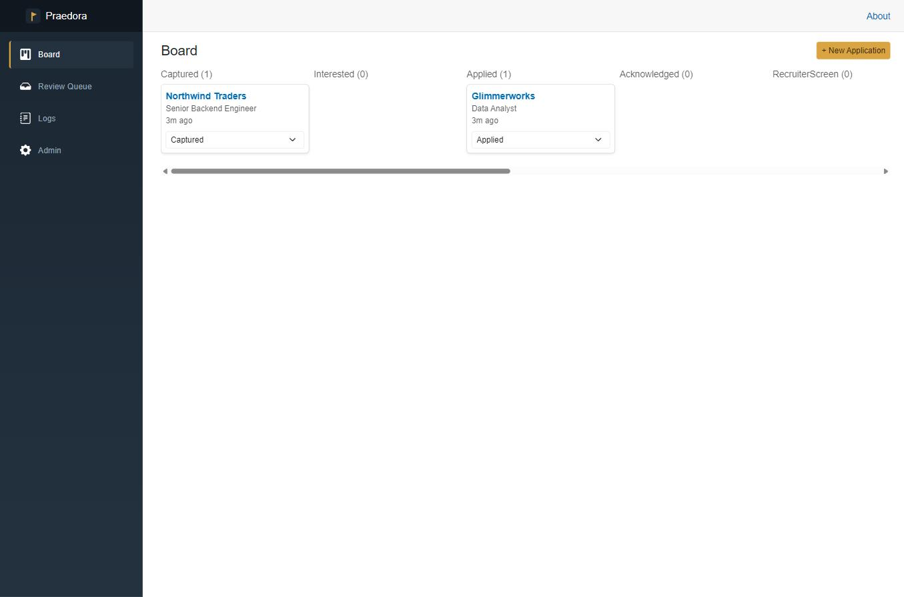
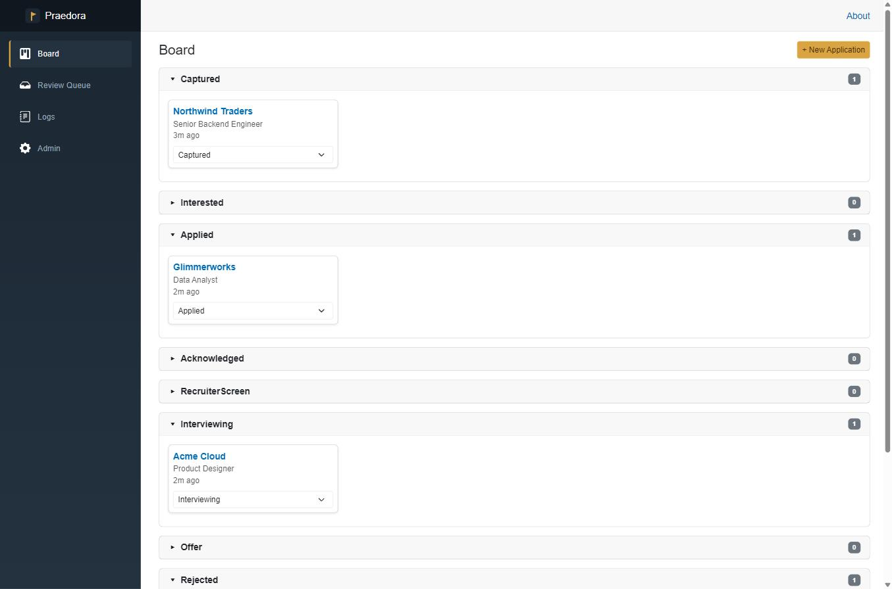
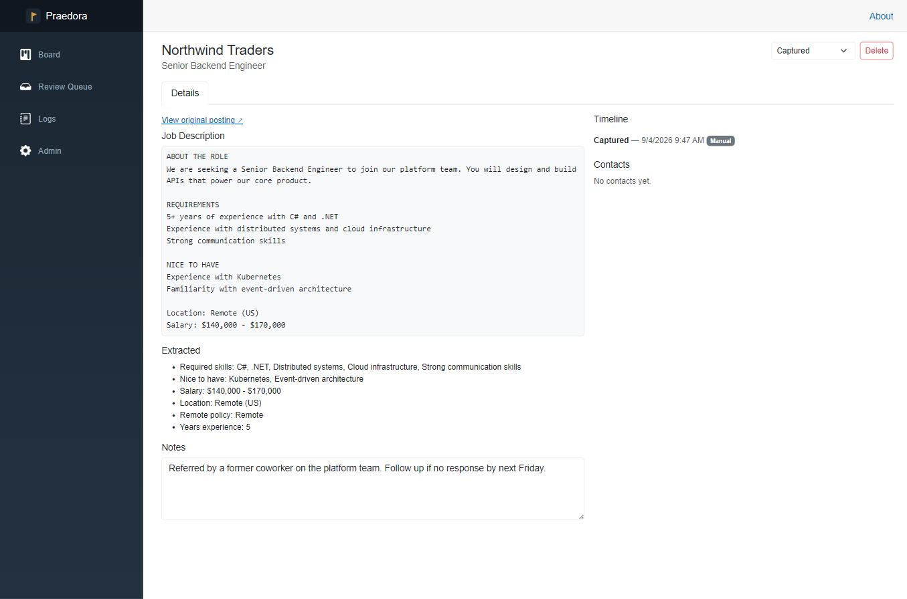
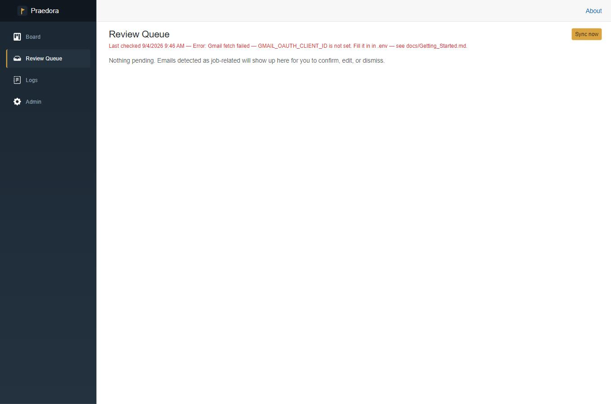
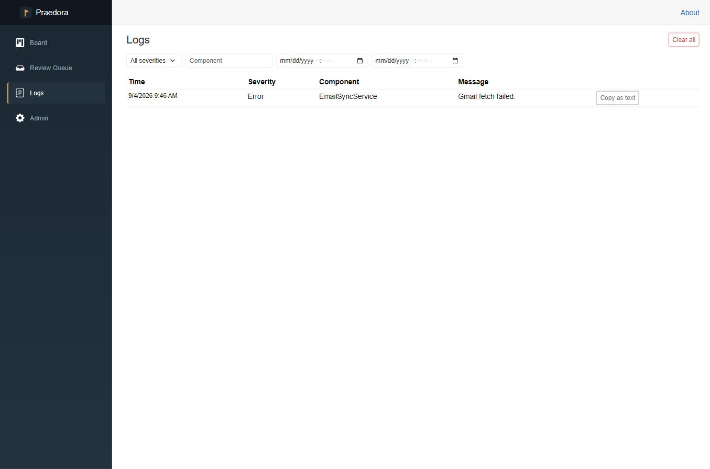
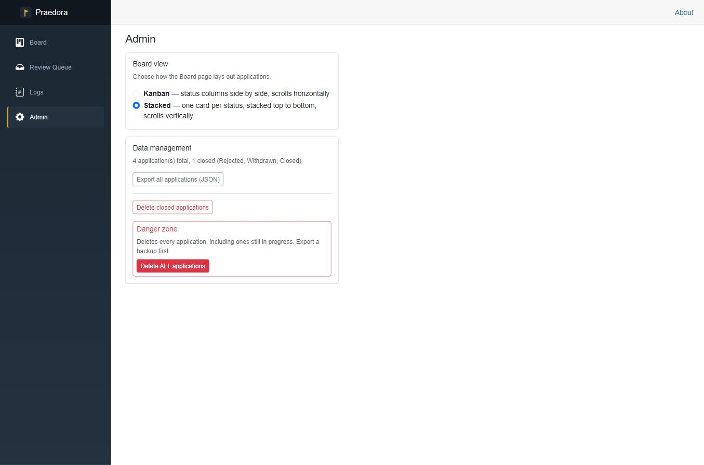

# User Guide

How Praedora works, page by page. If you haven't got it running yet, start with
**[Getting Started](Getting_Started.md)**.

## The Board

The Board is the home page — every application you're tracking, grouped by status (`Captured` →
`Interested` → `Applied` → `Acknowledged` → `RecruiterScreen` → `Interviewing` → `Offer`, or
`Rejected` / `Withdrawn` / `Closed`).

You can switch between two layouts on the **[Admin](#admin)** page:

**Kanban** — status columns side by side, scrolling horizontally. Good for seeing your whole
pipeline shape at a glance.

**Stacked** — one collapsible section per status, stacked top to bottom, scrolling vertically.
Good on a narrower window, or if you'd rather collapse statuses you don't care about right now.

Either way, each card shows the company, role, and how long since the last activity. Changing the
dropdown on a card progresses its status immediately and records the change in that application's
timeline.

## Capturing a job

There are two ways to add an application:

**Manually** — click **+ New Application** on the Board and fill in company, role, source URL,
and the job description text yourself. This path is quick but doesn't run job-description
extraction (see below).

**The Chrome extension** — one click from the job posting itself. With the
[extension loaded](Getting_Started.md#6-load-the-chrome-extension-optional), open a job posting
and click the Praedora icon. It looks for a `schema.org/JobPosting` block on the page first
(present on most boards — LinkedIn, Indeed, Greenhouse, Lever) and falls back to the page
title/text if there isn't one. It also grabs the page's URL automatically. Review the pre-filled
fields and click **Capture** — this creates the application (status `Captured`) and, if
`CLAUDE_API_KEY` is configured, extracts structured fields from the job description in the same
request.

## Application Details

Click any card to open its Details tab:

- **View original posting** — a link back to the source URL, when the application was captured
  with one (via the extension, or typed into the manual form).
- **Job Description** — the full raw text as captured.
- **Extracted** — only present when extraction succeeded: required skills, nice-to-have skills,
  salary range, location, remote policy, and years of experience, pulled from the job description
  by Claude.
- **Notes** — a free-text field, saved as you type (on blur).
- **Status** dropdown (top right) — same effect as changing it from a Board card.
- **Delete** — permanently removes this application and its full history. Confirms before acting;
  see [Admin → Data management](#data-management) for the bulk equivalent and for exporting a
  backup first.
- **Timeline** — every status change, in order, tagged with how it happened: `Manual` (you changed
  it), or `EmailConfirmed` (you confirmed a detected email — see below).
- **Contacts** — not populated by anything yet; always reads "No contacts yet."

## Review Queue

If Gmail sync is configured, Praedora periodically checks your inbox for messages that look
job-related, classifies them, and tries to match them to one of your applications. Detections
don't update your board directly — they land here first for you to confirm, edit, or dismiss.

Without Gmail configured, or before the first successful sync, you'll just see this:

Once something is detected, each entry shows the proposed new status, a confidence score, and the
email snippet that triggered it, plus one of:

- **Unmatched — pick an application** (grey badge) — Praedora couldn't match the email to any
  application by company name. **Confirm** is disabled until you fix this.
- **Multiple active matches — pick one** (yellow badge) — more than one active application matched
  the same company name. Praedora picked one, but double-check it's the right one before
  confirming.
- No badge — matched cleanly to exactly one active application.

Your options on each entry:

- **Confirm** — applies the proposed status to the matched application as a real `EmailConfirmed`
  status event, and removes the entry from the queue. Disabled while unmatched.
- **Edit** — pick a different status and/or application, and save — this applies immediately
  (it doesn't stage a second confirm step).
- **Dismiss** — drops the detection without touching any application. Use this for false
  positives ("your Amazon order has shipped" is not actually about a job).

**Sync now** (top right) triggers a sync immediately instead of waiting for the next timer tick;
the page also polls automatically every few seconds so results show up on their own once a sync
finishes. The line under the page title shows when Praedora last checked and whether it succeeded.

## Logs

A running log of what Praedora's background processes have done — mainly email sync activity and
classification outcomes, at `Info`/`Warning`/`Error` severity.

Filter by severity, component, or a date range. **Clear all** permanently deletes every log entry
(with a confirmation) — logs are diagnostic, not part of your application data, so this doesn't
touch anything on the Board.

## Admin

### Board view

Switch the Board between Kanban and Stacked (see [above](#the-board)). Takes effect immediately
and is remembered for next time.

### Data management

- **Export all applications (JSON)** — downloads every application, with its full status history,
  contacts, and extracted job-description fields, as one JSON file. This is a data-portability and
  inspection format, not a guaranteed restore path — for real disaster recovery, back up the
  database file itself (`praedora.db` next to wherever `Praedora.Api` runs from).
- **Delete closed applications** — permanently deletes every application whose status is
  `Rejected`, `Withdrawn`, or `Closed`, along with their history. Confirms first, showing exactly
  how many will be removed. Disabled when there aren't any.
- **Delete ALL applications** (Danger zone) — permanently deletes every application regardless of
  status, including ones still in progress. Confirms first, showing the total count. There's no
  in-app undo — export a backup first if you want one.

Either delete action also clears the match on any *pending* Review Queue entry that pointed at a
deleted application, so a stale detection degrades to "Unmatched" instead of erroring when you try
to confirm it.

## File Version

2026.09.04
